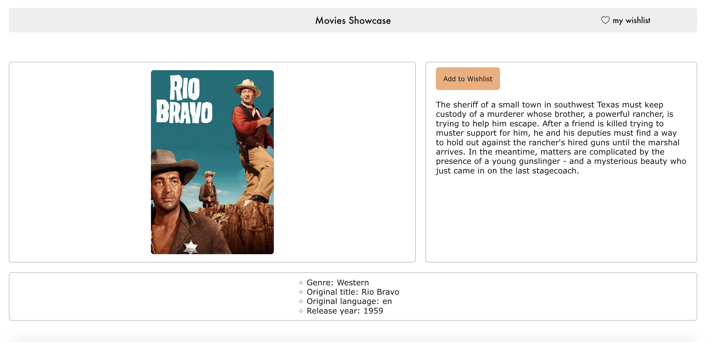
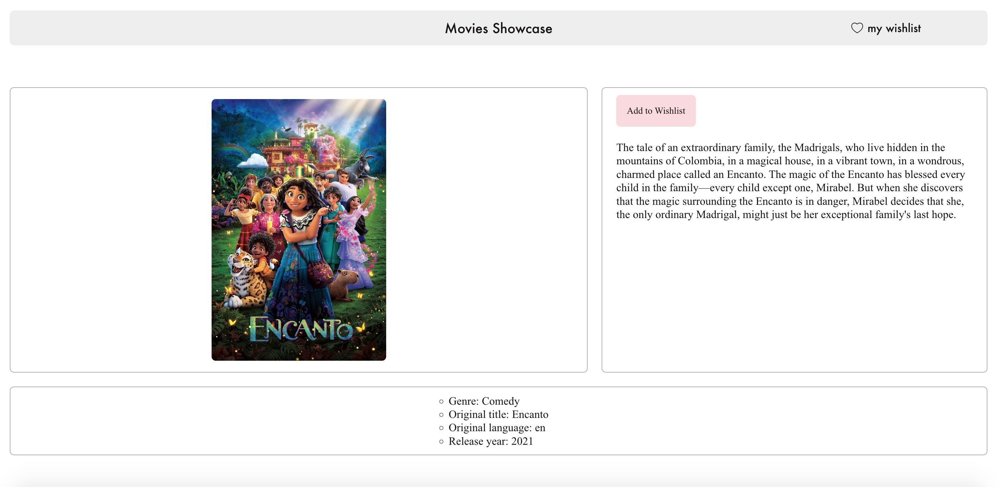
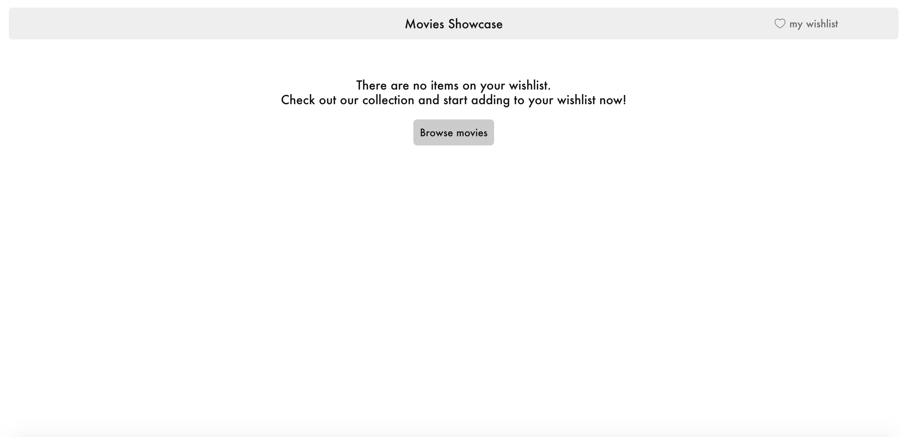

# Movies Showcase web app with SSR 🎬

React app with Server-Side Rendering using the API [TheMovieDatabase](https://developers.themoviedb.org/3/getting-started/introduction).

The project is bundled with [Webpack](https://webpack.js.org/): it supports hot reloading in development mode and is optimizated for production. The bundling also takes care of cross-browser support, using [Babel](https://babeljs.io/) for modern ECMAScript and [Autoprefixer](https://github.com/postcss/autoprefixer) for browser compliant styling.

The project includes both unit and end-to-end testing. The unit tests validate each component's functionality in isolation while the end-to-end test ensures the application flow behaves as expected (see `Local Installation` & `Testing` sections below). 

This web app is responsive across devices.

## Features
- Homepage with 3 carousels of items:
    - Each carousel is a different film category: Western / Music / Comedy 
    - The carousel's arrow next/prev buttons appear programatically based on scroll 
- Depending on the category of the selected item, the detail page has:
    - A different font
    - A different button
    - A different movie genre in the additional information area
- Wishlist section where added items can be viewed: items are stored in localStorage 

## Tech Stack
- app with React, Node.js, Express
- bundling with Webpack
- styling with SASS
- unit testing with Jest, React Testing Library
- end-to-end testing with Cypress

## Styling with SASS
- The naming convention used is [BEM](https://en.bem.info/methodology/naming-convention/#naming-rules). 
- The app's styling is applied over a style reset to ensure cross-browser compatibility
- The styling was built with reusability in mind: common styles are abstracted in `src/client/assets/sass`
- Webpack bundles SASS with `sass-loader`
- Browser compliant styling handled by [Autoprefixer](https://github.com/postcss/autoprefixer) for production builds

## Security 
The API [TheMovieDatabase](https://developers.themoviedb.org/3/getting-started/authentication) requires authentification with a private API key. To prevent the API key from being embedded in the final Webpack bundle (and being visible to anyone who inspects the code), a separate Express server calls the TheMovieDatabase API and serves the app.

## Performance & User Experience
The React app uses route-based code splitting to optimize bundling. In production, the build is optimized: the code and styling are minified and `source-map` is used as a dev-tool for its build speed.

The loading of ressources and errors are handled by the UI for best user experience:
- the homepage indicates the loading / error of the API response 
- the images display a placeholder during loading and a message in case of error

The Wishlist section shows its status to the useer:
- It displays the item count and the items that have been added to the Wishlist
- If it is empty, the Wishlist invites the user to browse the collection and add items.

## Accessibility & Cross-Browser
This app was built to be accessible to everyone. The elements are structured with semantic markup and they were built to deliver the same experience to all users. 

The Webpack bundling ensures that the app can be accessible to a broad range of browsers based on global usage (> 0.2%) for production builds.

## Local installation 

Clone the repository: 
```bash
https://github.com/AudreyKj/movies-showcase.git
```

Run these commands in the project directory:

- Install dependencies 
```bash
npm install
```

- Create an .env file and add your API key from TheMovieDatabase (see `.env-sample`)

- Run the app locally in development mode:

```bash
npm start
```

Open [http://localhost:3000](http://localhost:3000) to view it in the browser.

- Webpack production bundling:

```bash
npm run build
```

## Testing 

Run these commands in the project directory:

- Unit tests using React Testing Library & Jest (`src/client/testing/unit-testing`): 

```bash
npm run test-unit
```

- E2E tests using Cypress (located at: `src/client/testing/e2e-testing`): 

Make sure your local server is running (*npm start*) before running the E2E tests.

To run the tests:
```bash
npm run test-e2e
```
## Screenshots

Each carousel is a different category: Western / Music / Comedy movies:


The carousel next/prev buttons appear programatically based on scroll:


Details page for item from Western category (brown button & `Verdana` font):


Details page for item from Music category (blue button & `Courier New` font):


Details page for item from Comedy category (pink button & `Times New Roman` font):


Empty wishlist notification message:


Wishlist with items:


Error handling for API error:


Error handling for image source loading error (in this example, all the images' source fail to load):
